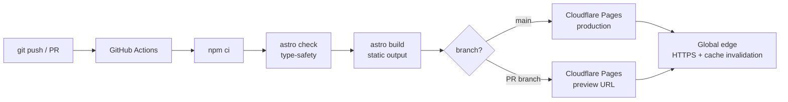

# Cloud Portfolio

[](https://github.com/your-handle/cloud-portfolio/actions/workflows/deploy.yml)
[](https://astro.build)
[](./LICENSE)

A fast, static personal portfolio — and a deliberately small but real piece of
DevOps. The site itself is shipped through an explicit CI/CD pipeline: there is
no click-ops, no manual upload, and no secret committed to the repo.

**Live:** https://cloud-portfolio.pages.dev _(update once deployed)_

---

## Why this repo is itself a portfolio piece

Anyone can drag-and-drop a static site into a host. This repo demonstrates the
parts a hiring manager actually cares about:

- **Infrastructure-as-pipeline** — the whole deploy lives in
  [`.github/workflows/deploy.yml`](.github/workflows/deploy.yml), version-controlled and re-runnable.
- **Preview environments** — every pull request gets its own isolated Cloudflare
  Pages URL before anything reaches production.
- **Build-time safety** — `astro check` type-checks the site; a broken type
  fails the deploy instead of shipping.
- **Secret hygiene** — no credentials in the repo. The only secrets are two
  GitHub Actions secrets, scoped to deployment.
- **Reproducibility** — committed `package-lock.json` + Node pinned via
  [`.nvmrc`](.nvmrc) means CI builds the exact same tree every time.

## Architecture



| Layer       | Choice                              | Why                                        |
| ----------- | ----------------------------------- | ------------------------------------------ |
| Framework   | [Astro](https://astro.build)        | Ships zero JS by default — fast static HTML |
| Styling     | [Tailwind CSS v4](https://tailwindcss.com) | One-file design tokens, no CSS sprawl |
| CI/CD       | GitHub Actions                      | Pipeline lives next to the code            |
| Deploy tool | [Wrangler](https://developers.cloudflare.com/workers/wrangler/) | First-class Cloudflare Pages deploys |
| Host        | Cloudflare Pages                    | Free, global edge, automatic HTTPS         |

## Local development

```bash
nvm use            # or use Node 20+
npm install
npm run dev        # http://localhost:4321
```

| Command             | Action                                        |
| ------------------- | --------------------------------------------- |
| `npm run dev`       | Start the dev server                          |
| `npm run build`     | Type-check (`astro check`) then build to `dist/` |
| `npm run preview`   | Serve the production build locally            |
| `npm run format`    | Format the project with Prettier              |

## Making it yours

Almost everything personal lives in three files — no need to touch markup:

- [`src/data/site.ts`](src/data/site.ts) — name, role, bio, contact, social links
- [`src/data/skills.ts`](src/data/skills.ts) — grouped skill tags
- [`src/data/projects.ts`](src/data/projects.ts) — project cards (with honest `live` / `building` / `planned` status)

Re-theme the whole site by changing `--color-accent` in
[`src/styles/global.css`](src/styles/global.css).

## Deployment

Deploys run automatically once the two secrets below exist. See
[`DEPLOYMENT.md`](DEPLOYMENT.md) for the full first-time setup walkthrough.

| GitHub Actions secret    | Where it comes from                              |
| ------------------------ | ------------------------------------------------ |
| `CLOUDFLARE_API_TOKEN`   | Cloudflare → My Profile → API Tokens (Pages: Edit) |
| `CLOUDFLARE_ACCOUNT_ID`  | Cloudflare dashboard → Workers & Pages → account ID |

## Project structure

```
.
├── .github/workflows/deploy.yml   # CI/CD pipeline
├── public/                        # static assets (favicon, robots.txt)
├── src/
│   ├── components/                # Header, Hero, Projects, Architecture, ...
│   ├── data/                      # site / skills / projects (edit these)
│   ├── layouts/Base.astro         # <head>, meta, fonts
│   ├── pages/index.astro          # the page
│   └── styles/global.css          # design tokens
├── astro.config.mjs
└── package.json
```

## License

[MIT](./LICENSE) © Eric Opoku
